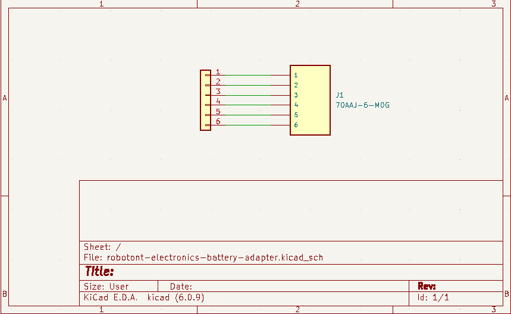
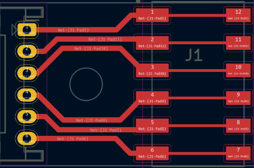
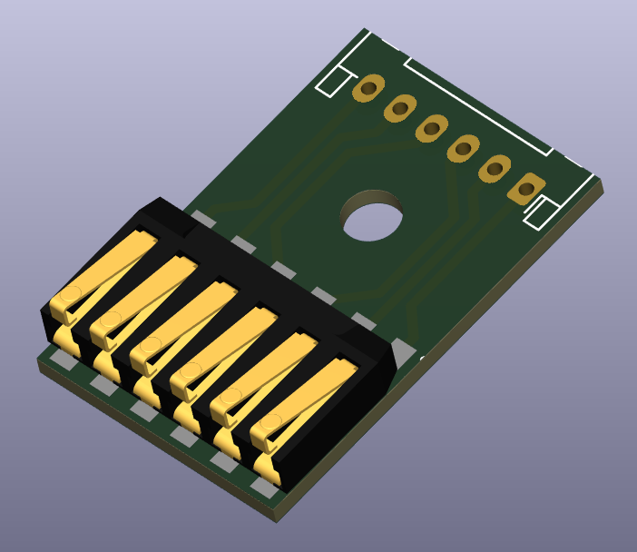

# robotont-electronics-battery-adapter
The repository contains KiCAD schematics and PCB layout for the battery adapter.
The Production folder contains prepared gerbers and BOM ready to order from e.g. JLCPCB.

## Schematics

## Layout

The following figures visualize the front side of the PCB along with the 3D model of the design.

